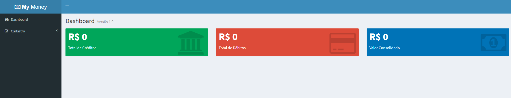
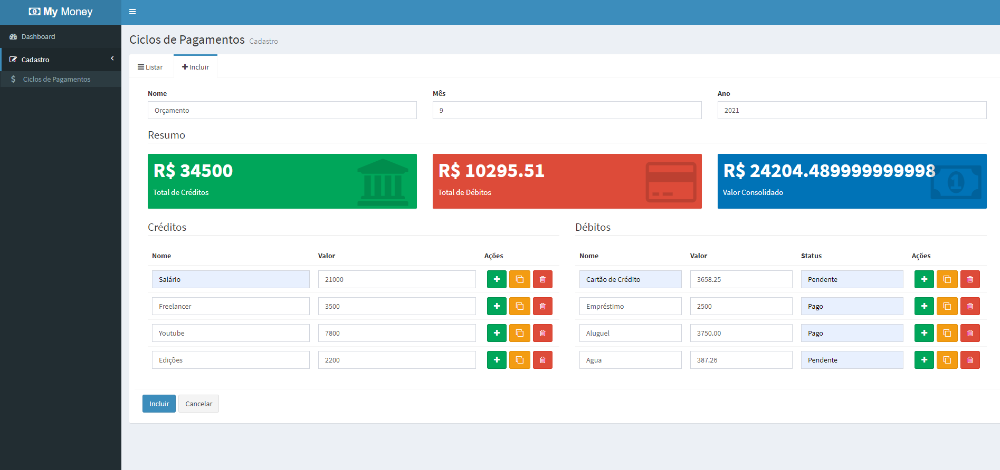

# Projetos-React

# Objetivo

Desenvolver uma aplicação Web de Controle de Ciclo de Pagamento com interface fácil e intuitiva buscando a melhor experiência pro usuário.
Nesse projeto foram implementados uma série de recursos legais do React além de gerenciamento de estado com Redux e muito mais!
O Usuário consegue cadastrar separadamente cada ciclo de pagamento mensal, inserindos os créditos e débitos.
E ainda tem a comodidade de ter um Dashboard do consolidado.
o App possiu layout responsivo.

# Tecnologias

Para desenvolver o projeto foram utilizados:
- JavaScript
- React
- Bootstrap
- Redux
- Middlewares
- AdminLTE

Backend:
- Mongoose
- Node Restful
- Nodemon
- Lodash
- Express
- BodyParser
- Pm2

Algumas dependências legais que foram utilizadas:

- Axios
- CssLoader
- Extract-Text-Webpack-Plugin
- IonIcons
- React DOM
- React Router
- Redux-Thunk
- Redux-Form
- Redux-Promise
- Redux-multi
- React-Redux-Toastr

# Layout

# Clone

Caso queira verificar o aplicativo rodando em sua máquina,  
basta clonar o repositório e através do terminal acessar a pasta clonada.  
Como não faz sentido subir a pasta node_modules pro git, você irá perceber que a mesma está faltando.  
Para resolver, muito simples, basta executar o comando "npm i -E" que todas as dependências necessárias  
serão lidas no package.json e baixadas em sua máquina. Depois basta executar o projeto normalmente.

# Créditos

Os códigos são de autoria do professor Leonardo Moura Leitao (https://github.com/leonardomleitao)  
E foram reproduzidos por Fernando Piattelli no decorrer do curso.
