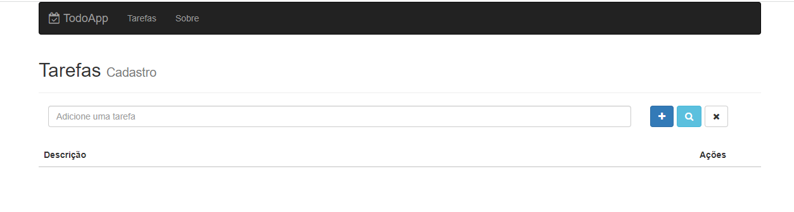

# Projetos-React

# Objetivo

Desenvolver uma aplicação web de lista de tarefas onde o usuário tem acesso a uma interface simples e amigável,
para cadastrar suas tarefas do dia a dia. Foram implementados recursos para permitir marcar uma tarefa como
concluída ou não concluída. Além de poder pesquisar e filtrar as tarefas por meio de palavras chaves.
Nessa versão foi utilizado gerenciamento de estado com o redux e aplicado 3 tipos diferentes de middlewares!

# Tecnologias

Para desenvolver o projeto foram utilizados:
- JavaScript
- React
- Bootstrap
- Redux
- Middlewares

Backend:
- Mongoose
- Node Restful
- Nodemon
- Express
- BodyParser

Algumas dependências legais que foram utilizadas:

- Axios
- CssLoader
- Extract-Text-Webpack-Plugin
- Font-awesome
- React DOM
- React Router
- Redux-Thunk
- Redux-Multi
- Redux-Promise

# Layout

# Clone

Caso queira verificar o aplicativo rodando em sua máquina,  
basta clonar o repositório e através do terminal acessar a pasta clonada.  
Como não faz sentido subir a pasta node_modules pro git, você irá perceber que a mesma está faltando.  
Para resolver, muito simples, basta executar o comando "npm i -E" que todas as dependências necessárias  
serão lidas no package.json e baixadas em sua máquina. Depois basta executar o projeto normalmente.

# Créditos

Os códigos são de autoria do professor Leonardo Moura Leitao (https://github.com/leonardomleitao)  
E foram reproduzidos por Fernando Piattelli no decorrer do curso.
