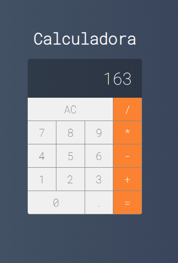

# Projetos-React

# Objetivo

Desenvolver uma aplicação web de uma calculadora, com interface simples e funcional,
capaz de executar as principais operações: soma, subtração, divisão e multiplicação.
Nesse projeto foram abordados conceitos de estilização css e componentes individuais!

# Tecnologias

Para desenvolver o projeto foram utilizados:
- JavaScript
- React

# Layout

# Clone

Caso queira verificar o aplicativo rodando em sua máquina,  
basta clonar o repositório e através do terminal acessar a pasta clonada.  
Como não faz sentido subir a pasta node_modules pro git, você irá perceber que a mesma está faltando.  
Para resolver, muito simples, basta executar o comando "npm i -E" que todas as dependências necessárias  
serão lidas no package.json e baixadas em sua máquina. Depois basta executar o projeto normalmente.

# Créditos

Os códigos são de autoria do professor Leonardo Moura Leitao (https://github.com/leonardomleitao)  
E foram reproduzidos por Fernando Piattelli no decorrer do curso.
